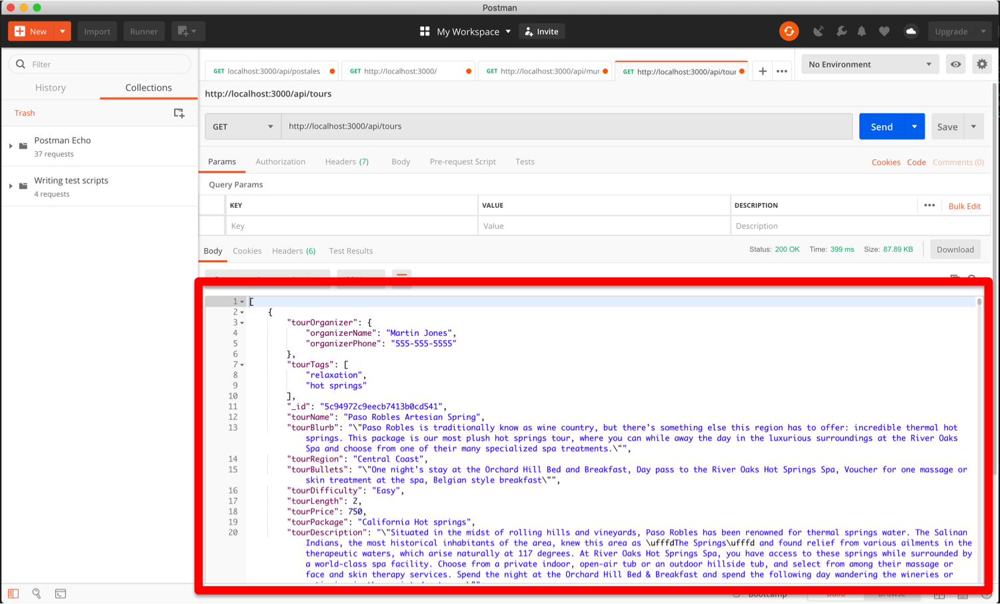
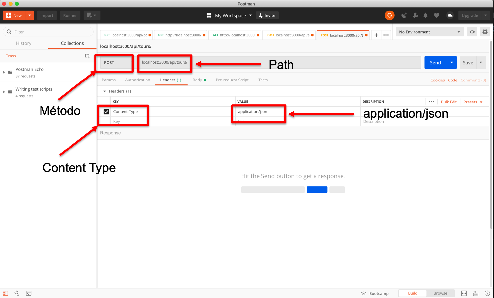
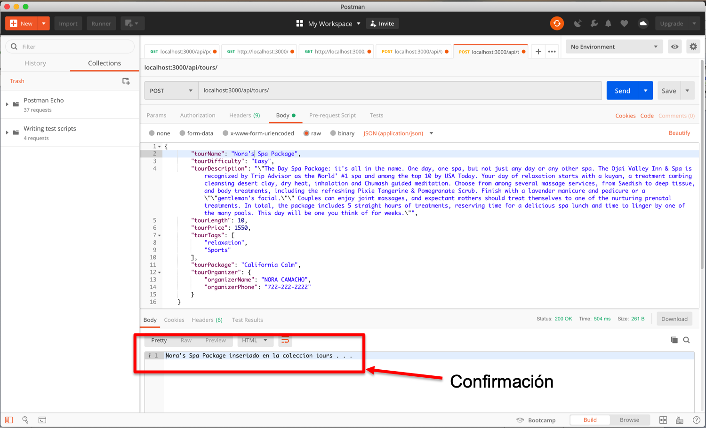
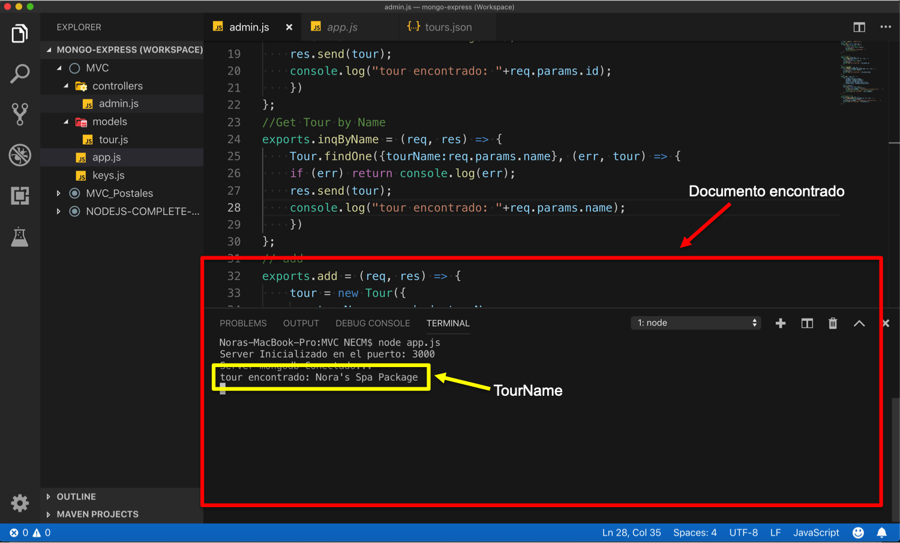

# MVC-Tours-Express
Mongodb, Express, Node Js, MVC

## REST Web Services 
Son programas basados en REST, que permiten manipular información (GET, POST, PUT, DELETE), para acceder a la información, requieren de una URL, método HTTP, entregan la información en formato JSON,  
REST ( Representational State Transfer) es una arquitectura basada en el estándar web y utiliza el protocolo HTTP.

> Los métodos más usados en una API REST son:

>> - __GET: Obtiene recursos.__
>> - __POST: Crea recursos.__
>> - __PUT: Actualiza / modifica recursos.__
>> - __DELETE: Eliminar recursos.__

En la siguiente tabla se muestran los PATHS:

| MÉTODO  | PATH |  OPERACIÓN  |
| ------------- | ------------- |
| GET  | /api/tours |  GET ALL  |
| GET  | /api/tours/:id | GET BY ID  |
| ADD  |  /api/tours |  ADD ONE  |
| DELETE  |  /api/tours/:id |  DELETE ONE  |

## Arquitectura MVC
MVC es uno de los patrones de arquitectura más utilizados en el desarrollo web, esta se divide en  Modelo, Vista y Controlador. En el Modelo, la estructura de la base de datos. En el controlador, la lógica. En la vista, la interfaz de usuario.

### Importación de colecciones
#### 1.- Se realizó la importación de las colecciones tour, restaurants y postal (códigos postales del estado de México) a MongoDb Atlas, está se hizo por medio de la terminal de comandos.

#### 2.- Se confirma que las colecciones efectivamente se encuentren en la base de datos learning_mongo en MongoDB Atlas.

#### 3.- Se realizó la instalación de las librerías requeridas mediante el uso de la terminal de comandos: 

#### 4.- Generamos las estructura MVC (Modelo Vista Controlador) en nuestro espacio de trabajo de Visual Estudio Code:

#### 5.- En el archivo /MVC/app.js se escribe el requerimiento de librerías y drivers, la configuración del Web Server y parsee de datos.

#### 6.- Una vez configurado el Web Server, se verificó el mensaje de encendido.

#### 7.- Dentro de la carpeta modelos creamos el archivo tours.js. Este lo editamos y creamos el modelo de la API.

#### 8.- Se escribió el código de las API en el archivo MVC/controllers/admin.js (GET, POSTy DELETE).

#### 9.- En el archivo /MVC/app.js se escribe las rutas (paths) para las API.

#### 10.- Nuevamente validamos el mensaje de encendido de el server web y db server.

### 11.- En Postman y probamos los métodos y sus paths, empezamos con el método GET (inq) o en este caso es un “GET-All” ya que regresa todos los tours que se encuentran en la colección tour, el path para este método es “/api/tours” -> “http://localhost:3000/api/tours”

### 12.- Se indica el path en el espacio para URL, clic en “send”, y se muestran los tours encontrados.

### 13.- Método add. Se prueba la operación POST, path: http://localhost:3000/api/tours”, se agrega un objeto a la  colección Tour.

### 14.- Los datos del objeto a ingresar se en el body, se debe seguir el mismo modelo de los objetos de la colección. 

### 15.- Una vez validado, se presiona enviar (send) y el objeto es agregado a la colección, y la API regresa un mensaje de confirmación

### 16.- En este caso, el mensaje de confirmación también es enviado a la consola.

### 17.- Método inqId, este método regresa un objeto único siempre y cuando su Id corresponda al mismo Id que se solicita en la URL. Si existe un objeto con el Id, regresa el objeto a Postman.

### 18.- En este caso, la API también regresa el objeto a la consola junto con un mensaje de confirmación de que el objeto se ha encontrado.

### 19.- Método inqByName, regresa un objeto único siempre que el nombre corresponda al mismo nombre que se solicita en la URL. Si existe, regresa lo regresa a Postman en formato JSON.

### 20.- También regresa a la consola un mensaje de confirmación de que el objeto ha sido encontrado. 

### 21.- Método delete. En este caso, la API regresa el nombre del objeto junto con un mensaje de confirmación de que el objeto ha sido eliminado.

### 22.- En la consola, regresa el Id del objeto junto con la confirmación de eliminación exitosa.

